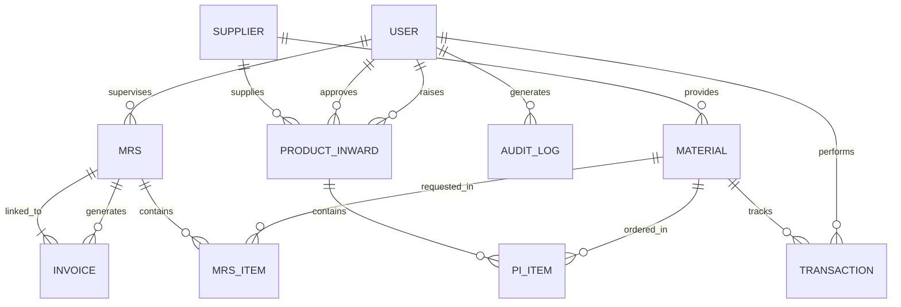

# Database Schema Documentation

This document provides a comprehensive overview of the database architecture used in the **TexKnit Stock Management Application**. The system uses a flexible schema powered by the **Peewee ORM**, supporting both SQLite (default) and PostgreSQL.

---

## 📊 Entity Relationship Diagram

---

## 🛠 Table Definitions

### 1. User (`User`)
Stores authentication and authorization data.
- `username`: Unique identifier.
- `password`: Bcrypt-hashed credentials.
- `role`: Access level (`ADMIN`, `SUPERVISOR`, `STORE_MANAGER`).
- `created_at`: Timestamp of account creation.

### 2. Supplier (`Supplier`)
Manages vendor information and performance metrics.
- `name`: Company name.
- `contact_person`: Primary contact.
- `rating`: 0-5 star calculated performance.
- `material_categories`: Comma-separated categories (Auxiliaries, Chemicals, etc).

### 3. Material (`Material`)
The core inventory table with specialized chemical safety tracking.
- `name / code`: Identification.
- `quantity`: Current live stock level.
- `min_stock`: Threshold for low-stock alerts.
- **Safety Fields**: `hazard_class`, `expiry_date`, `storage_temp_range`.

### 4. MRS (Material Request Slip)
Tracks internal requests for material issuance.
- `batch_id`: Reference for production batches.
- `status`: `PENDING`, `ISSUED`, `REJECTED`, `PARTIALLY_ISSUED`.

### 5. Product Inward (`ProductInward`)
Manages procurement workflow from Raising to Inwarding.
- `status`: `RAISED`, `APPROVED`, `COMPLETED`.
- `reason`: Justification for procurement.

### 6. Invoice (`Invoice`)
Handles sales and billing.
- `invoice_no`: Unique professional numbering.
- `grand_total`: Final amount including tax.
- **Snapshots**: Stores immutable copies of company/client details at the time of generation for legal compliance.

### 7. Audit Log (`AuditLog`)
Security table tracking every critical mutation in the system.
- `action`: Type of operation (e.g., `STOCK_ADJUSTMENT`).
- `details`: JSON blob containing "Before/After" state or metadata.

---

## ⚙️ Configuration
The system allows switching between **SQLite** for standalone desktop use and **PostgreSQL** for multi-user networks via the `config.json` file.
