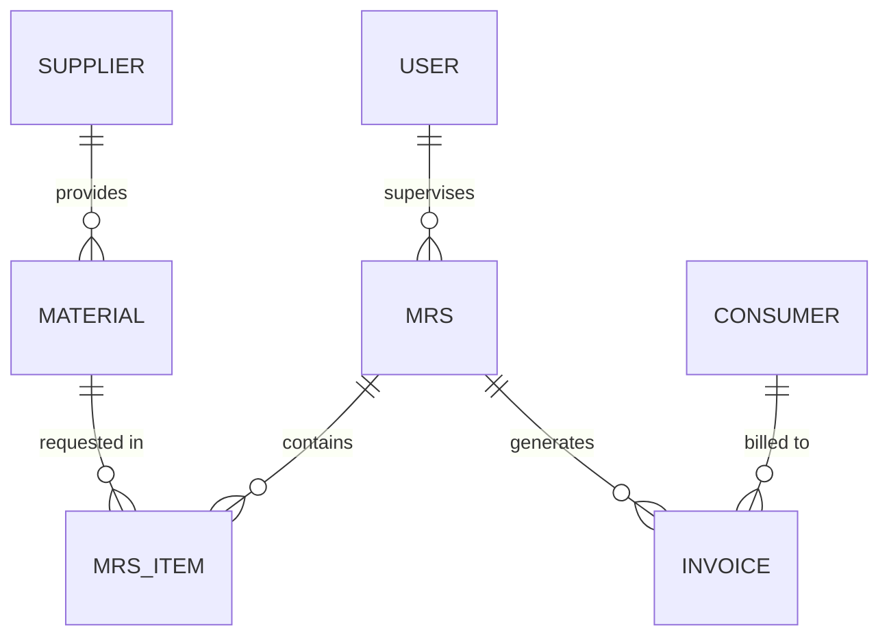

# Database Schema Documentation (Simplified)

This document focuses on the core tables used for **Invoicing and Material Management**.

---

## 🏗 Core DBML Schema
Copy this to [dbdiagram.io](https://dbdiagram.io) for a clean visual.

```dbml
Table users {
  id integer [primary key]
  username varchar
  role varchar
}

Table suppliers {
  id integer [primary key]
  name varchar
  contact_person varchar
}

Table materials {
  id integer [primary key]
  name varchar
  unit_cost float
  supplier_id integer
}

Table mrs {
  id integer [primary key]
  batch_id varchar
  supervisor_id integer
}

Table mrs_items {
  id integer [primary key]
  mrs_id integer
  material_id integer
}

Table consumers {
  id integer [primary key]
  company_name varchar [unique]
  gst_no varchar
}

Table invoices {
  id integer [primary key]
  invoice_no varchar
  mrs_id integer
  client_name varchar
  grand_total float
}

// Relationships
Ref: materials.supplier_id > suppliers.id
Ref: mrs.supervisor_id > users.id
Ref: mrs_items.mrs_id > mrs.id
Ref: mrs_items.material_id > materials.id
Ref: invoices.mrs_id > mrs.id
Ref: invoices.client_name > consumers.company_name
```

---

## 📊 Core ER Diagram (Flow)


